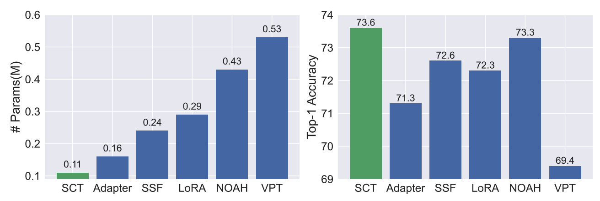

<h1 align="center">SCT: A Simple Baseline for Parameter-Efficient Fine-Tuning via Salient Channels
</h1>
<div align="center">

</div>
<h4>We found that tuning only a small number of task-specific channels, referred to as salient channels, is sufficient. This work represents a remarkable reduction of 780x in parameter costs compared to its full fine-tuning counterpart.</h4>


## 🔨 Environment Setup
```
conda create -n SCT python=3.8
conda activate SCT
pip install -r requirements.txt
```

## Data Preparation

### 1. Visual Task Adaptation Benchmark (VTAB)

- Images
    
    Please refer to [VTAB-source](https://github.com/ZhangYuanhan-AI/NOAH/tree/main/data/vtab-source) to download the datasets.

### 2. Few-Shot and Domain Generation

- Images

    Please refer to [DATASETS.md](https://github.com/KaiyangZhou/CoOp/blob/main/DATASETS.md) to download the datasets.

- Train/Val/Test splits

    Please refer to the files under `data/XXX/XXX/annotations` for the detail information.


## 🚀 Quick Start For SCT
We use the VTAB experiments as an example.

### 1. Downloading the Pre-trained Model
| Model | Weight |
|-------|------|
|ViT-B/16 | [ViT-B_16.npz](https://storage.googleapis.com/vit_models/imagenet21k/ViT-B_16.npz)|
|ViT-L/16 | [ViT-L_16.npz](https://storage.googleapis.com/vit_models/imagenet21k/ViT-L_16.npz)|
|ViT-H/14 | [ViT-H_14.npz](https://storage.googleapis.com/vit_models/imagenet21k/ViT-H_14.npz)|
|Swin-B | [swin_base_patch4_window7_224_22k.pth](https://github.com/SwinTransformer/storage/releases/download/v1.0.0/swin_base_patch4_window7_224_22k.pth)|


```
mkdir released_models

wget https://storage.googleapis.com/vit_models/imagenet21k/ViT-B_16.npz

wget https://github.com/SwinTransformer/storage/releases/download/v1.0.0/swin_base_patch4_window7_224_22k.pth
```

### 2. Training
```
sh run_model_sct.sh
```

### 🎓 Cite

```
@article{zhao2023sct,
  title={SCT: A Simple Baseline for Parameter-Efficient Fine-Tuning via Salient Channels},
  author={Zhao, Henry Hengyuan and Wang, Pichao and Zhao, Yuyang and Luo, Hao and Wang, Fan and Shou, Mike Zheng},
  journal={International Journal of Computer Vision},
  pages={1--19},
  year={2023},
  publisher={Springer}
}
```


## Acknowledgement
Part of the code is borrowed from [timm](https://github.com/rwightman/pytorch-image-models).

